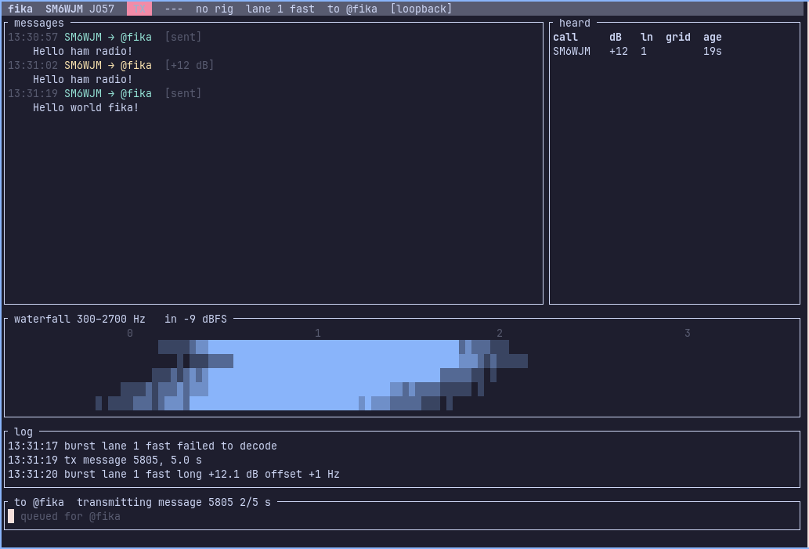

# fika

Group chat over HF radio. Type a message, press send, and every station on the
channel that can hear you gets it, even while others are sending. fika is a
64-tone MFSK mode across a 2.4 kHz SSB channel with per-symbol tone hopping
and a GF(64) LDPC code decoded at symbol level, so several stations
transmitting at the same time are all decoded. Built for ordinary SSB
transceivers, a sound card, and a Raspberry Pi, with no dependence on
internet time or GPS.



*The terminal UI transmitting to itself over the speakers (v1 screenshot: the
v2 waveform hops over the whole band). The same burst decodes at +12 dB.*

## In numbers

Sensitivity is quoted the way FT8 reports it: signal power against the
noise power in a 2500 Hz SSB passband. At −10 dB the signal carries a tenth
of the noise power in the receiver; you hear nothing but hiss.

| | fika fast | fika slow |
|---|---|---|
| Decodes down to (AWGN, 50 % of messages, simulated) | **−10.2 dB** | **−19.3 dB** |
| Bandwidth | 2400 Hz | 2400 Hz |
| Net text rate | ~110 bit/s, about 25 characters per second | ~19 bit/s, about 4 per second |
| 240-character message on air | 7.7 s | 46 s |
| Several stations transmitting at the same time in the same band | 2, 3 and 4 equal-power senders all decoded (simulated, −6 dB each) | same code, not yet measured |
| Needs a clock, internet or GPS | no | no |

How that compares with modes people actually run, using their commonly
quoted figures:

| Mode | Bandwidth | Text rate | Solid copy down to | Error correction | Overlapping senders |
|---|---|---|---|---|---|
| RTTY 45 | 250 Hz | ~6 char/s | about −5 dB | none | no |
| PSK31 | 60 Hz | ~5 char/s | about −10 dB | none | no |
| Olivia 16/500 | 500 Hz | ~2 char/s | about −13 dB | heavy, rate 1/4 | no |
| **fika fast** | 2400 Hz | ~25 char/s | **−10.2 dB** | GF(64) LDPC | **yes, several** |
| JS8Call normal | 50 Hz | ~1.5 char/s | about −21 dB | LDPC | no (time slots) |
| FT8 | 50 Hz | 77 bits per 15 s | −21 dB | LDPC | no (time slots) |
| **fika slow** | 2400 Hz | ~4 char/s | **−19.3 dB** | GF(64) LDPC | yes |

What makes fika different is that the receiver decodes at symbol level with
a non-binary code over 64 tones: when two or three stations key up on top of
each other, each costs the others about one bit per symbol instead of the
whole message. Combined with error correction, tone hopping over the whole
band (a carrier or a notch costs symbols, not messages) and non-coherent
detection (phase flutter costs only the usual fading penalty), it is built
for a crowded, informal channel rather than for spectral efficiency, where
PSK31 does about forty times more bits per hertz.

Caveats, honestly: the fika figures are from the simulator in this
repository, within a decibel of theory and not yet confirmed on the air.
Under selective fading (CCIR moderate) the fast profile needs about −2 dB.
2400 Hz is a wide digital mode, for the wide-digimode band segments. The
other modes' numbers are the figures their communities quote, give or take
a decibel.

Status: modem, protocol layer, channel simulator, station runtime and a
terminal UI work end to end in simulation, in software loopback on the
speakers, and over a PipeWire virtual channel between terminals. Nothing has
been on the air yet.

## Development shell

```sh
direnv allow    # once; loads the nix dev shell from flake.nix
cargo test
just --list     # sweeps, fading, multi-station, loopback recipes
```

The shell provides the Rust toolchain, ALSA headers for cpal, hamlib (for
`rigctld`), `just` and `sox`.

## Try it

```sh
# Encode a message to a WAV file and decode it again.
cargo run -p fika-cli -- tx --from SM6WJM --to @fika --text "Hej, kaffet är klart ☕ 73" -o fika.wav
cargo run -p fika-cli -- rx fika.wav

# Decode rate against SNR (2500 Hz reference, like FT8 reports) on AWGN
# and on a CCIR moderate Watterson channel.
cargo run --release -p fika-cli -- sim --profile fast --channel awgn --sweep=-14:-9:1 --trials 50
cargo run --release -p fika-cli -- sim --profile fast --channel moderate --sweep=-12:-2:2 --trials 30

# Three stations transmitting at once in the same band, then two 10 dB apart.
cargo run --release -p fika-cli -- multi --stations 3 --snr=-6
cargo run --release -p fika-cli -- multi --stations 2 --snr=-8 --spread-db 10 -v

# Impairments: ITU-R F.1487 presets (low/mid/high-latitude quiet, moderate,
# disturbed, mid-nvis), interferers inside the band, lightning static,
# frequency drift and the rig's SSB passband.
cargo run --release -p fika-cli -- sim --channel high-moderate --sweep=-8:0:2
cargo run --release -p fika-cli -- sim --snr=-6 --interferer cw:1100:6 --interferer rtty:1300:-3
cargo run --release -p fika-cli -- sim --snr=-8 --impulsive 5:2:20 --drift 1 --bandpass

# Regression suite: decode rate per scenario must stay above a floor.
just channels
```

The channel models live in `crates/fika-channel`: AWGN calibrated to the
2500 Hz reference, Watterson two-path fading with Gaussian Doppler spectra
(CCIR 520 and all ten ITU-R F.1487 presets), flat Rayleigh, frequency
offset and drift, sample-clock error, steady carriers, keyed CW, RTTY and
PSK31-like interferers, impulsive noise and a 300–2700 Hz passband.
`tools/gr_channel.py` passes a WAV through GNU Radio's gr-channels blocks
as an independent cross-check; it needs GNU Radio installed, for example
`nix shell nixpkgs#gnuradio`, and models mobile-style Jakes fading rather
than the HF Watterson model, so expect agreement in trend only.

## On the air, or just on the speakers

`fika-tui` is the station: a chat window, a heard list, a waterfall of the
passband and an input line. It is configured with a TOML file:

```sh
fika-tui --example-config > fika.toml     # edit call, grid, audio, rig
fika-tui --list-audio                      # device names to use in [audio]
fika-tui -c fika.toml
```

- **With a radio.** Set `[audio]` input and output to the rig's sound card
  (the IC-705 and FT-891 appear as "USB Audio CODEC") and `[rig] kind =
  "rigctld"` with the address of a running `rigctld`. PTT, dial frequency
  and optionally data mode go through hamlib.
- **Without a radio.** Set `input = "none"`, `output = "default"` and
  `loopback = true`. Bursts play on the speakers, and the same samples are
  fed into the receiver at playback pace, so you hear the modem and watch
  your own message decode. `just tui-loopback` does this.

- **Several stations on one host.** `just tui-live SM6WJM` in one terminal
  and `just tui-live AD8KM` in another. Every station plays into and
  listens to one PipeWire virtual sink, `fika-ether`, adds its own band
  noise at the configured SNR, and passes its bursts through a channel
  model on the way out (`just tui-live OH2ABC -12 poor` for −12 dB over a
  CCIR poor channel). Two stations sending at the same time are both
  decoded by a third. Half duplex applies: a station does not
  hear the ether while it is keyed. `just live-down` removes the sink.
  This uses the native PipeWire backend (`[audio] backend = "pipewire"`),
  which addresses nodes by name; `--no-default-features` builds without it.

In the TUI, type and press Enter to send. `/to @group`, `/to CALL` or
`/to all` changes the destination, `/profile fast|slow` the speed,
`/beacon` sends a beacon, F1 shows help. Direct messages
request an acknowledgement and show a delivery status.

Crates: `fika-modem` (physical layer), `fika-proto` (frames, callsigns,
groups, text coding), `fika-channel` (AWGN, Watterson, clock error,
interferers), `fika-cli` (the `fika` binary), `fika-station` (audio, rig,
streaming receiver, transmit queue), `fika-tui` (the terminal UI).

Copyright 2026 Albin Stigö SM6WJM.
